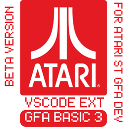

# GFA BASIC 3.6 Enhanced Syntax Highlighting for VS Code



## Description

This is a comprehensive Visual Studio Code extension that provides enhanced syntax highlighting, auto-indentation, code snippets, and intelligent code assistance for the **GFA BASIC 3.6** programming language, primarily used on Atari ST systems.

This enhanced version significantly improves upon the original extension with:
- **Complete instruction recognition** - Over 200+ GFA BASIC 3.6 instructions properly categorized
- **Advanced variable type detection** - Proper recognition of GFA BASIC variable suffixes ($, %, &, |, !)
- **Comprehensive syntax highlighting** - Distinct colors for different language elements
- **Smart auto-indentation** - Automatic indentation for all control structures
- **Rich code snippets** - Pre-built templates for common GFA BASIC patterns
- **Hover documentation** - Inline help for GFA BASIC keywords and functions
- **Symbol navigation** - Quick navigation to procedures, functions, and labels

## Features

### 🎨 Enhanced Syntax Highlighting

- **Control Flow Keywords**: `IF`, `FOR`, `WHILE`, `REPEAT`, `SELECT`, `PROCEDURE`, etc.
- **Graphics Instructions**: `PSET`, `LINE`, `BOX`, `CIRCLE`, `SETCOLOR`, `VSYNC`, etc.
- **System Instructions**: `XBIOS`, `PEEK`, `POKE`, `DPEEK`, `DPOKE`, `LPEEK`, `LPOKE`, etc.
- **Math Operations**: `SHR`, `SHL`, `AND`, `OR`, `XOR`, `RAND`, `ABS`, `SQR`, etc.
- **Memory Management**: `BMOVE`, `MALLOC`, `MFREE`, `VARPTR`, etc.
- **String Functions**: `LEN`, `LEFT`, `RIGHT`, `MID`, `INSTR`, `STR`, `VAL`, etc.
- **I/O Operations**: `PRINT`, `INPUT`, `OPEN`, `CLOSE`, `READ`, `WRITE`, etc.

### 🔤 Variable Type Recognition

Properly recognizes GFA BASIC 3.6 variable types:
- `variable$` - String variables (highlighted in string color)
- `variable%` - 32-bit integer variables (highlighted in integer color)
- `variable&` - 16-bit integer variables (highlighted in integer color)
- `variable|` - 8-bit integer variables (highlighted in integer color)
- `variable!` - Boolean variables (highlighted in boolean color)
- `variable` - Float variables (default highlighting)

### 🔢 Number Format Support

- **Decimal**: `123`, `456.789`
- **Hexadecimal**: `&H1A2B`, `&HFFFF8240`
- **Binary**: `&X10110101`, `&X11111111`

### 🏗️ Smart Auto-Indentation

Automatic indentation for all GFA BASIC control structures:
- `FOR...NEXT` loops
- `WHILE...WEND` loops
- `REPEAT...UNTIL` loops
- `DO...LOOP` loops
- `IF...ELSE...ENDIF` conditionals
- `SELECT...CASE...ENDSELECT` statements
- `PROCEDURE...RETURN` blocks
- `FUNCTION...ENDFUNC` blocks

### 📝 Rich Code Snippets

Pre-built code templates for:
- Control structures (FOR, WHILE, IF, SELECT)
- Procedure and function definitions
- Graphics operations (PSET, LINE, BOX, CIRCLE)
- Memory operations (PEEK, POKE, DPEEK, DPOKE)
- Array declarations
- Common programming patterns

### 💡 Intelligent Code Assistance

- **Hover Documentation**: Hover over keywords to see syntax and usage information
- **Symbol Navigation**: Quick navigation to procedures, functions, and labels
- **Auto-completion**: Smart suggestions for GFA BASIC keywords and functions

## Installation

### From VS Code Marketplace
1. Open Visual Studio Code
2. Go to Extensions (Ctrl+Shift+X)
3. Search for "GFA BASIC 3.6 Enhanced"
4. Click Install

### Manual Installation
1. Download the `.vsix` file from the releases
2. Open VS Code
3. Press `Ctrl+Shift+P` to open command palette
4. Type "Extensions: Install from VSIX"
5. Select the downloaded `.vsix` file

## Usage

1. Create a new file with `.lst` extension
2. Start coding in GFA BASIC 3.6
3. Enjoy syntax highlighting, auto-indentation, and code assistance!

### Example Code

```gfabasic
' GFA BASIC 3.6 Example Program
' Graphics and Animation Demo

' Variable declarations
DIM colors%(16)          ' Color palette array
DIM x&(100), y&(100)     ' Coordinate arrays
speed! = TRUE            ' Animation speed flag
counter| = 0             ' 8-bit counter
screen_addr% = XBIOS(2)  ' Get screen address

' Initialize color palette
FOR i| = 0 TO 15
  SETCOLOR i|, RAND(8), RAND(8), RAND(8)
  colors%(i|) = i|
NEXT i|

' Main animation loop
REPEAT
  ' Clear screen
  CLS
  
  ' Draw animated graphics
  FOR i& = 0 TO 99
    x&(i&) = 160 + SIN(counter| + i&) * 100
    y&(i&) = 100 + COS(counter| + i&) * 50
    PSET x&(i&), y&(i&), colors%(i& MOD 16)
  NEXT i&
  
  ' Update animation
  INC counter|
  VSYNC
  
UNTIL INKEY$ <> ""

END
```

## Supported File Extensions

- `.lst` - GFA BASIC listing files

## Language Features

### Comments
- Line comments: `' This is a comment`
- Inline comments: `! This is also a comment`

### Control Structures
- Conditional: `IF...THEN...ELSE...ENDIF`
- Selection: `SELECT...CASE...DEFAULT...ENDSELECT`
- Loops: `FOR...TO...NEXT`, `WHILE...WEND`, `REPEAT...UNTIL`, `DO...LOOP`
- Procedures: `PROCEDURE...RETURN`
- Functions: `FUNCTION...ENDFUNC`

## Contributing

Contributions are welcome! If you find bugs or want to add features:

1. Fork the repository
2. Create a feature branch
3. Make your changes
4. Submit a pull request

## Resources

- [GFA BASIC Reference](https://gfabasic.net/stg/gfabasic.htm)
- [GFA BASIC Instructions](https://www.gladir.com/CODER/GFABASIC/reference.htm)
- [Atari ST Development](https://info-coach.fr/atari/documents/general/gfabasic.pdf)
- [GBE - GFA BASIC Editor](https://gfabasic.net/htm/gbe_faq.htm)

## License

MIT License - Feel free to use, modify, and distribute.

## Author

**Hylst** - Passionate about Atari ST development and retro programming

## Changelog

### Version 2.0.0
- Complete rewrite with enhanced syntax highlighting
- Added comprehensive instruction recognition (200+ instructions)
- Improved variable type detection
- Added smart auto-indentation
- Added rich code snippets
- Added hover documentation
- Added symbol navigation
- Enhanced language configuration

### Version 1.0.0
- Initial release with basic syntax highlighting
---

*Happy coding on your Atari ST! 🖥️*